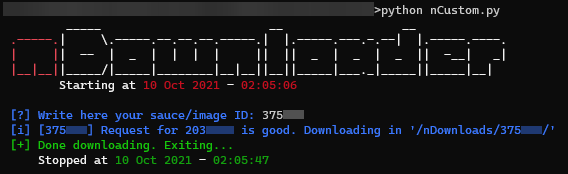
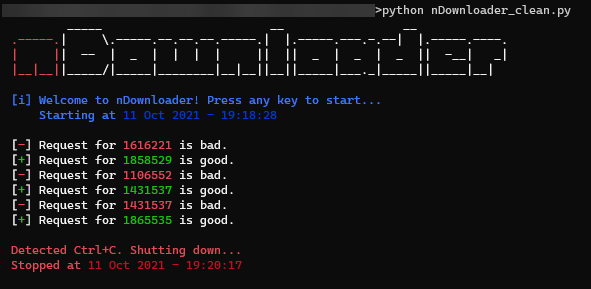
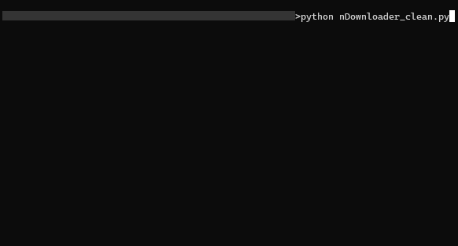

<div align=center>
  <h1>nDownloader</h1>
  <b>Nothing to see here again... Now optimized.</b><br><br>
    <a href="https://github.com/r4v10l1/nDownloader/network/members"></a>
      <a href="https://github.com/r4v10l1/nDownloader/stargazers"></a>
</div>

#

It is a python script that downloads lots of hentai images based on random ids from [nhentai](https://nhentai.net).

* With `nDownloder.py`, it writes one line per request. Use `nDownloader_clean.py` for a much cleaner look.
* To download a single id, use [`nCustom/nCustom.py`](https://github.com/r4v10l1/nDownloader/blob/main/nCustom/nCustom.py). You can use the image id (7 digits) or the sauce (6 digits).

#

⚠️ If you download a lot of images, you might get banned! I am not responsible at all. ⚠️

Although the download rate will be slower, the `useTorProxy` option is recomended.

#

### Installing

``` shell
git clone https://github.com/r4v10l1/nDownloader/
cd nDownloader
python -m pip install -r requirements.txt
python nDownloader_clean.py
```

### Configuration

* You can edit the `operative_system` variable to add some more colors in linux.
* You can edit the `useTorProxy` variable to enable the use of a proxy during the requests. If you enable this, you will need to have tor open and the port it will use will be **9150**.

### Logs

The script writes the following information into a log (`nDownloaded.log`):
* When the user starts the program
* When the user stops the program
* When the script downloads something. (It will write a line per id, not per image)

#

### Screenshots



